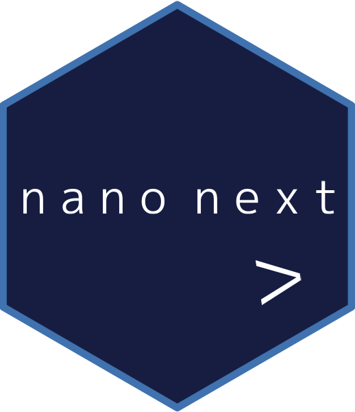

<!-- README.md is generated from README.Rmd. Please edit that file -->

```{r, include = FALSE}
knitr::opts_chunk$set(
  collapse = TRUE,
  comment = "#>",
  fig.path = "man/figures/README-",
  out.width = "100%"
)
```

# nanonext <a href="https://shikokuchuo.net/nanonext/" alt="nanonext"></a>

<!-- badges: start -->
[](https://CRAN.R-project.org/package=nanonext)
[](https://shikokuchuo.r-universe.dev) 
[](https://github.com/shikokuchuo/nanonext/actions)
<!-- badges: end -->

R binding for NNG (Nanomsg Next Gen), a successor to ZeroMQ. NNG is a socket library providing high-performance scalability protocols, implementing a cross-platform standard for messaging and communications. Serves as a concurrency framework for building distributed applications, utilising 'Aio' objects which automatically resolve upon completion of asynchronous operations.

Designed for performance and reliability, the NNG library is written in C and {nanonext} is a lightweight wrapper depending on no other packages. Provides the interface for code and processes to communicate with each other - receive data generated in Python, perform analysis in R, and send results to a C++ program – all on the same computer or on networks spanning the globe.

Implemented scalability protocols:

- Bus (routing)
- Pair (two-way radio)
- Pipeline (one-way pipe)
- Publisher/Subscriber (topics & broadcast)
- Request/Reply (I ask, you answer)
- Survey (everyone votes)

Implemented transports:

- inproc (intra-process)
- IPC (inter-process)
- TCP/IP (IPv4 or IPv6)
- WebSocket

### Table of Contents

1. [Installation](#installation)
2. [Interfaces](#interfaces)
3. [Cross-language Exchange](#cross-language-exchange)
4. [Async and Concurrency](#async-and-concurrency)
5. [Deferred Evaluation Pipe](#deferred-evaluation-pipe)
6. [RPC and Distributed Computing](#rpc-and-distributed-computing)
7. [Publisher / Subscriber Model](#publisher-subscriber-model)
8. [Surveyor / Repondent Model](#surveyor-respondent-model)
9. [ncurl Minimalist http Client](#ncurl-minimalist-http-client)
10. [Building from source](#building-from-source)
11. [Links](#links)

### Installation

Install the latest release from CRAN:

```{r cran, eval=FALSE}
install.packages("nanonext")
```

or the development version from rOpenSci R-universe:

```{r runiv, eval=FALSE}
install.packages("nanonext", repos = "https://shikokuchuo.r-universe.dev")
```

### Interfaces

{nanonext} offers 2 equivalent interfaces: an object-oriented interface, and a functional interface.

#### Object-oriented Interface

The primary object in the object-oriented interface is the nano object. Use `nano()` to create a nano object which encapsulates a Socket and Dialer/Listener. Methods such as `$send()` or `$recv()` can then be accessed directly from the object.

*Example using Request/Reply (REQ/REP) protocol with inproc transport:* <br />
(The inproc transport uses zero-copy where possible for a much faster solution than alternatives)

Create nano objects:

```{r example}
library(nanonext)
nano1 <- nano("req", listen = "inproc://nanonext")
nano2 <- nano("rep", dial = "inproc://nanonext")
```

Send message from 'nano1':

```{r send}
nano1$send("hello world!")
```

Receive message using 'nano2':

```{r recv}
nano2$recv()
```

#### Functional Interface 

The primary object in the functional interface is the Socket. Use `socket()` to create a socket, and optionally dial or listen at an address. The socket is then passed as the first argument of subsequent actions such as `send()` or `recv()`.

*Example using Pipeline (Push/Pull) protocol with TCP/IP transport:*

Create sockets:

```{r example2}
library(nanonext)
socket1 <- socket("push", listen = "tcp://127.0.0.1:5555")
socket2 <- socket("pull", dial = "tcp://127.0.0.1:5555")
```

Send message from 'socket1':

```{r send2}
send(socket1, "hello world!")
```

Receive message using 'socket2':

```{r recv2}
recv(socket2)
```

[&laquo; Back to ToC](#table-of-contents)

### Cross-language Exchange

{nanonext} provides a fast and reliable data interface between different programming languages where NNG has a binding, including C, C++, Java, Python, Go, Rust etc. 

The following example demonstrates the exchange of numerical data between R and Python (NumPy), two of the most commonly-used languages for data science and machine learning. 

Using a messaging interface provides a clean and robust approach, light on resources with limited and identifiable points of failure. This is especially relevant when processing real-time data, as an example. 

This approach can also serve as an interface / pipe between different processes written in the same or different languages, running on the same computer or distributed across networks, and is an enabler of modular software design as espoused by the Unix philosophy.

Create socket in Python using the NNG binding 'pynng':

```{python rnpy1}
import numpy as np
import pynng
socket = pynng.Pair0(listen="ipc:///tmp/nanonext.socket")
```

Create nano object in R using {nanonext}, then send a vector of 'doubles', specifying mode as 'raw':

```{r rnpy2}
library(nanonext)
n <- nano("pair", dial = "ipc:///tmp/nanonext.socket")
n$send(c(1.1, 2.2, 3.3, 4.4, 5.5), mode = "raw")
```

Receive in Python as a NumPy array of 'floats', and send back to R:

```{python rnpy3}
raw = socket.recv()
array = np.frombuffer(raw)
print(array)

msg = array.tobytes()
socket.send(msg)
```

Receive in R, specifying the receive mode as 'double':

```{r rnpy4}
n$recv(mode = "double")
```

[&laquo; Back to ToC](#table-of-contents)

### Async and Concurrency

{nanonext} implements true async send and receive, leveraging NNG as a massively-scaleable concurrency framework.

```{r async}

s1 <- socket("pair", listen = "inproc://nano")
s2 <- socket("pair", dial = "inproc://nano")

```

`send_aio()` and `recv_aio()` functions return immediately with an 'Aio' object, but perform their operations async.

An 'Aio' object returns an unresolved value whilst its asynchronous operation is ongoing, automatically resolving to a final value once complete.

```{r async4}

# an async receive is requested, but no mesages are waiting (yet to be sent)
msg <- recv_aio(s2)
msg
msg$data

```

For a 'sendAio' object, the result is stored at `$result`.

```{r async2}

res <- send_aio(s1, data.frame(a = 1, b = 2))
res
res$result

# an exit code of 0 denotes a successful send
# note: the send is successful as long as the message has been accepted by the socket for sending
# the message itself may still be buffered within the system

```

For a 'recvAio' object, the message is stored at `$data`, and the raw message at `$raw` (if kept).

```{r async3}

# now that a message has been sent, the 'recvAio' automatically resolves
msg$data
msg$raw

```

Auxiliary function `unresolved()` may be used in control flow statements to perform actions which depend on resolution of the Aio, both before and after. This means there is no need to actually wait (block) for an Aio to resolve, as the example below demonstrates.

```{r async5}

msg <- recv_aio(s2)

# unresolved() queries for resolution itself so no need to use it again within the while clause
while (unresolved(msg)) {
  # do stuff before checking resolution again
  send_aio(s1, "resolved")
  cat("unresolved")
}

# perform actions which depend on the Aio value outside the while loop
msg$data
```

The values may also be called explicitly using `call_aio()`. This will wait for completion of the Aio (blocking).

```{r async7}

# will wait for completion then return the resolved Aio
call_aio(msg)

# to access the resolved value directly (waiting if required)
call_aio(msg)$data

close(s1)
close(s2)

```

[&laquo; Back to ToC](#table-of-contents)

### Deferred Evaluation Pipe

{nanonext} implements a deferred evaluation pipe `%>>%` for working with potentially unresolved values.

Simply pipe the value forward into a function or series of functions and it either evaluates or returns an 'unresolvedExpr'.

The result may be queried at `$data`, which will return another 'unresolvedExpr' recursively (by design) whilst unresolved. However when the original value resolves, the 'unresolvedExpr' will resolve into a 'resolvedExpr' and the evaluated expression may then be accessed at \code{$data}. 

It is possible to use `unresolved()` around a 'unresolvedExpr' or its `$data` field to test for resolution, as in the example below.

The pipe operator semantics are similar to R's base pipe `|>`:

`x %>>% f` is equivalent to `f(x)` <br />
`x %>>% f()` is equivalent to `f(x)` <br />
`x %>>% f(y)` is equivalent to `f(x, y)`

```{r async6}

s1 <- socket("pair", listen = "inproc://cecicestunepipe")
s2 <- socket("pair", dial = "inproc://cecicestunepipe")

# request an aysnc receive with no messages waiting
msg <- recv_aio(s2)

res <- msg$data %>>% c(2, 3) %>>% as.character()
res
unresolved(res$data)

# sending a message causes both 'msg' and 'res' to resolve
s <- send_aio(s1, 1)
unresolved(res)
res
res$data

close(s1)
close(s2)

```

[&laquo; Back to ToC](#table-of-contents)

### RPC and Distributed Computing

{nanonext} implements remote procedure calls (RPC) using NNG's req/rep protocol to provide a basis for distributed computing. 

Can be used to perform computationally-expensive calculations or I/O-bound operations such as writing large amounts of data to disk in a separate 'server' process running concurrently.

Server process: `reply()` will wait for a message and apply a function, in this case `rnorm()`, before sending back the result.

```{r rpcserver, eval=FALSE}

library(nanonext)
rep <- socket("rep", listen = "tcp://127.0.0.1:6546")
ctxp <- context(rep)
reply(ctxp, execute = rnorm, send_mode = "raw") 

```

Client process: `request()` performs an async send and receive request and returns immediately with a `recvAio` object.

```{r rpcclient}

library(nanonext)
req <- socket("req", dial = "tcp://127.0.0.1:6546")
ctxq <- context(req)
aio <- request(ctxq, data = 1e8, recv_mode = "double", keep.raw = FALSE)

```

At this point, the client can run additional code concurrent with the server processing the request. 

```{r rpcclient2}
# do more...
```

When the result of the server calculation is required, the `recvAio` may be called using `call_aio()`.

The return value from the server request is then retrieved and stored in the Aio as `$data`.

```{r rpcclient3}

call_aio(aio)

aio
aio$data |> str()

```

As `call_aio()` is blocking and will wait for completion, an alternative is to query `aio$data` directly. This will return an 'unresolved' logical NA value if the calculation is yet to complete.

In this example the calculation is returned, but other operations may reside entirely on the server side, for example writing data to disk.

In such a case, calling or querying the value confirms that the operation has completed, and provides the return value of the function, which may typically be NULL or an exit code.

The {mirai} package <https://shikokuchuo.net/mirai/> (available on CRAN) uses {nanonext} as the back-end to provide asynchronous execution of arbitrary R code using the RPC model.

[&laquo; Back to ToC](#table-of-contents)

### Publisher Subscriber Model

{nanonext} fully implements NNG's pub/sub protocol as per the below example.

The built-in logging levels are also demonstrated here. NNG errors are always output to stderr and operation is otherwise silent by default. To enable key information events to be sent to stdout, use `logging(level = "info")`. 

The log level can also be set externally in production environments via an environment variable `NANONEXT_LOG`.

```{r pub}

logging(level = "info")

pub <- socket("pub", listen = "inproc://nanobroadcast")
sub <- socket("sub", dial = "inproc://nanobroadcast")

sub |> subscribe(topic = "examples")
pub |> send(c("examples", "this is an example"), mode = "raw", echo = FALSE)
sub |> recv(mode = "character", keep.raw = FALSE)

pub |> send(c("other", "this other topic will not be received"), mode = "raw", echo = FALSE)
sub |> recv(mode = "character", keep.raw = FALSE)

# specify NULL to subscribe to ALL topics
sub |> subscribe(topic = NULL)
pub |> send(c("newTopic", "this is a new topic"), mode = "raw", echo = FALSE)
sub |> recv("character", keep.raw = FALSE)

sub |> unsubscribe(topic = NULL)
pub |> send(c("newTopic", "this topic will now not be received"), mode = "raw", echo = FALSE)
sub |> recv("character", keep.raw = FALSE)

# however the topics explicitly subscribed to are still received
pub |> send(c("examples", "this example will still be received"), mode = "raw", echo = FALSE)
sub |> recv(mode = "character", keep.raw = FALSE)

# set logging level back to the default of errors only
logging(level = "error")

close(pub)
close(sub)

```

[&laquo; Back to ToC](#table-of-contents)

### Surveyor Respondent Model

This type of pattern is useful for applications such as service discovery.

A surveyor sends a survey, which is broadcast to all peer respondents. Respondents are then able to reply, but are not obliged to. The survey itself is a timed event, and responses received after the timeout are discarded.

```{r survey}

sur <- socket("surveyor", listen = "inproc://nanoservice")
res1 <- socket("respondent", dial = "inproc://nanoservice")
res2 <- socket("respondent", dial = "inproc://nanoservice")

# sur sets a survey timeout, applying to this and subsequent surveys
sur |> survey_time(500)

# sur sends a message and then requests 2 async receives
sur |> send("service check", echo = FALSE)
aio1 <- sur |> recv_aio()
aio2 <- sur |> recv_aio()

# res1 receives the message and replies using an aio send function
res1 |> recv(keep.raw = FALSE)
res1 |> send_aio("res1")

# res2 receives the message but fails to reply
res2 |> recv(keep.raw = FALSE)

# checking the aio - only the first will have resolved
aio1$data
aio2$data

# after the survey expires, the second resolves into a timeout error
Sys.sleep(0.5)
aio2$data

close(sur)
close(res1)
close(res2)

```

Above it can be seen that the final value resolves into a timeout, which is an integer 5 classed as 'errorValue'. All receive functions class integer error codes as 'errorValue' to be easily distinguishable from integer message values.

[&laquo; Back to ToC](#table-of-contents)

### ncurl Minimalist http Client

`ncurl()` is a minimalistic http(s) client. In normal use, it takes only one argument, the URL. It can follow redirects.

```{r ncurl}

ncurl("http://httpbin.org/headers")

```

For advanced use, supports additional HTTP methods such as POST or PUT.

[&laquo; Back to ToC](#table-of-contents)

### Building from source

#### Linux / Mac / Solaris

Installation from source requires the C library 'libnng' along with its development headers.

This is available in system package repositories as:

-   `libnng-dev` (deb)
-   `nng-devel` (rpm)
-   `nng` (Homebrew on MacOS)
-   `nng` from vcpkg (see <https://vcpkg.io/>).

A system installation of 'libnng' in the standard filesystem locations will be detected and used if possible.

Otherwise, a release version of 'libnng' will be downloaded and built from source automatically during package installation (note: this requires 'cmake').

#### Windows

Pre-built libraries (for i386 / x64 / x64-UCRT) are automatically downloaded during the package installation process.

#### TLS Support

If your system installation of NNG was built with TLS support (using Mbed TLS), please set the environment variable `Sys.setenv(NANONEXT_TLS=1)` before attempting to install the package. This will ensure the correct linker flags are set for a successful install.

#### Certain ARM architectures

If package installation initially fails with an error message of `unable to load shared object:[ ] undefined symbol: __atomic_fetch_sub_8` or similar, please set the environment variable
`Sys.setenv(NANONEXT_ARM=1)` and then proceed with installation again.

### Links

nanonext on CRAN: <https://cran.r-project.org/package=nanonext><br />
Package website: <https://shikokuchuo.net/nanonext/><br />

NNG website: <https://nng.nanomsg.org/><br />
NNG documentation: <https://nng.nanomsg.org/man/tip/><br />

[&laquo; Back to ToC](#table-of-contents)
